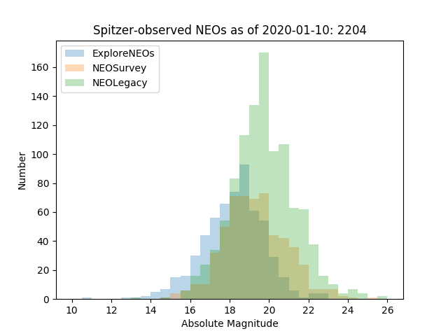
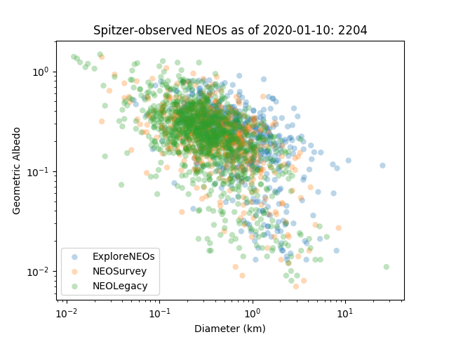

SpitzerNEOs - The Full Dataset
==============================

This repository contains flux density measurements, as well as diameter and
albedo estimates, for the majority (if not
all) Near-Earth Objects that were ever observed with the `Spitzer Space
Telescope` and serves as a backup for the `official SpitzerNEOs website
<http://nearearthobjects.nau.edu/spitzerneos.html>`_. The resulting data set
contains 2204 diameter and albedo estimates for 2132 different objects.

The data compiled here are publicly available. If you use the data, please cite
`Trilling et al. 2010 <https://ui.adsabs.harvard.edu/abs/2010AJ....140..770T/abstract>`_ and
`Trilling et al. 2016 <https://ui.adsabs.harvard.edu/abs/2016AJ....152..172T/abstract>`_.

Near-Earth Objects
------------------

Near Earth Objects (NEOs) are small Solar System bodies whose orbits bring them close to the Earth's orbit. NEOs lie at the intersection of Solar System evolution science, space exploration, and civil defense. They are compositional and dynamical tracers from elsewhere in the Solar System; the study of NEOs allows us to probe environmental conditions throughout the Solar System and the history of our planetary system, and provides a template for analyzing the evolution of planetary disks around other stars. NEOs are the parent bodies of meteorites, one of our key sources of detailed knowledge about the Solar System's development, and NEO studies are the essential context for this work. The space exploration of NEOs is primarily carried out through robotic spacecraft (NEAR, Hayabusa, Chang'e 2, Hayabusa-2, OSIRIS-REx). Energetically, some NEOs are easier to reach with spacecraft than the Earth's moon, and NEOs offer countless targets with a range of physical properties and histories. Finally, NEOs are a civil defense matter: the impact threat from NEOs is real, as demonstrated in Chelyabinsk, Russia, in February, 2013. Understanding the number and properties of NEOs affects our planning strategies, international cooperation, and overall risk assessment.

NEOs typically have daytime temperatures around 250 K. Hence, their thermal emission at 4.5 μm is almost always significantly larger than their reflected light. We can therefore employ a thermal model to derive NEO diameters and albedos. This makes the Spitzer Space Telescope the most powerful NEO characterization telescope ever built, reaching 3σ sensitivities of ~1.5 μJy in 10,000 seconds, and able to observe thousands of NEOs.

Observing Programs
------------------

The majority of observations in this data set stem from three major observing
campaigns summarized below. The data set is supplemented by data from smaller
projects.

* `ExploreNEOs <https://ui.adsabs.harvard.edu/abs/2008sptz.prop60012T/abstract>`_
  is a Spitzer Cycle 6 Exploration Science program which was
  carried out between 2009 July and 2011 November. It was composed of a total
  of 599 AORs and obtained observations in both the 3.6 and 4.5 μm bands. All
  observations and modeling are complete and in the database. The Spitzer
  program IDs are 60012, 61010, 61011, 61012, and 61013. The project is
  described in
  `Trilling et al. 2010`_.

* `NEOSurvey <https://ui.adsabs.harvard.edu/abs/2014sptz.prop11002T/abstract>`_
  (Program ID 11002) is a Spitzer Cycle 11 Exploration Science
  program which was carried out between 2015 February to 2016 September. It
  was composed of a total of 570 AORs and obtained observations in the 4.5 μm
  band. All observations and modeling are complete and in the database. The
  project is described in
  `Trilling et al. 2016 <https://ui.adsabs.harvard.edu/abs/2016AJ....152..172T/abstract>`_.

* `NEOLegacy <https://ui.adsabs.harvard.edu/abs/2016sptz.prop13006T/abstract>`_
  (Program ID 13006) is a Spitzer Cycle 13 Frontier Legacy Science
  program which was begun in 2016 October and is still executing. As of 2018
  March, a total of 714 AORs have executed and are in the database. IRAC
  photometry is obtained at 4.5 μm. Observations are scheduled through 2018 September.

These three major observing campaigns were awarded a total of almost
3,000~hrs of Spitzer observing time.

For a full list of related publications, please refer to this
`page <http://nearearthobjects.nau.edu/pubs.html>`_.

Data Set
--------

The data set contains 2204 observations of 2132 different NEOs. The total
elapsed time of these observations amounts to

    The distribution of absolute magnitudes across the three main surveys.

    The distribution of geometric albedos vs. diameters in the
    three main surveys.

Data is provided in the form of a csv file that can be easily read in, e.g.,
using Python Pandas:

>>> import pandas as pd
>>> data = pd.read_csv('spitzerneos.csv')

For each observation, the
following fields are provided:

+----------+----------------------------------+----------------+------------+
| Field    | Field Name                       | Data Type      | Data Unit  |
+==========+==================================+================+============+
| desig    | MPC Designation                  | text           |            |
+----------+----------------------------------+----------------+------------+
| number   | MPC Number                       | integer        |            |
+----------+----------------------------------+----------------+------------+
| name     | Target Name                      | text           |            |
+----------+----------------------------------+----------------+------------+
| survey   | Spitzer Survey                   | text           |            |
+----------+----------------------------------+----------------+------------+
| ra       | Target RA at Midtime (J2000)     | float          | deg        |
+----------+----------------------------------+----------------+------------+
| dec      | Target Dec at Midtime (J2000)    | float          | deg        |
+----------+----------------------------------+----------------+------------+
| vmag     | Predicted Target V Magnitude     | float          | mag        |
+----------+----------------------------------+----------------+------------+
| heldist  | Heliocentric Distance at Midtime | float          | au         |
+----------+----------------------------------+----------------+------------+
| obsdist  | Distance from Spitzer at Midtime | float          | au         |
+----------+----------------------------------+----------------+------------+
| alpha    | Solar Phase Angle at Midtime     | float          | deg        |
+----------+----------------------------------+----------------+------------+
| elong    | Solar Elongation at Midtime      | float          | deg        |
+----------+----------------------------------+----------------+------------+
| glxlon   | Galactic Longitude at Midtime    | float          | deg        |
+----------+----------------------------------+----------------+------------+
| glxlat   | Galactic Latitude at Midtime     | float          | deg        |
+----------+----------------------------------+----------------+------------+
| ra3sig   | 3 sigma Uncertainty in RA        | float          | arcsec     |
+----------+----------------------------------+----------------+------------+
| dec3sig  | 3 sigma Uncertainty in Dec       | float          | arcsec     |
+----------+----------------------------------+----------------+------------+
| midtime  | Observation Midtime (UT)         | text           | ISO        |
+----------+----------------------------------+----------------+------------+
| midtimejd| Observation Midtime (UT)         | float          | JD         |
+----------+----------------------------------+----------------+------------+
| aorkey   | Observation AOR Key              | integer        |            |
+----------+----------------------------------+----------------+------------+
| framet   | Frame Time                       | float          | s          |
+----------+----------------------------------+----------------+------------+
| totalt   | Total Integration Time           | float          | s          |
+----------+----------------------------------+----------------+------------+
| elapsed  | Total Elapsed Time               | float          | s          |
+----------+----------------------------------+----------------+------------+
| a        | Semi-Major Axis                  | float          | au         |
+----------+----------------------------------+----------------+------------+
| e        | Eccentricity                     | float          |            |
+----------+----------------------------------+----------------+------------+
| node     | Ascending Node                   | float          | deg        |
+----------+----------------------------------+----------------+------------+
| argper   | Argument of the Periapsis        | float          | deg        |
+----------+----------------------------------+----------------+------------+
| period   | Orbital Period                   | float          | yr         |
+----------+----------------------------------+----------------+------------+
| absmag   | Absolute Magnitude in V          | float          | mag        |
+----------+----------------------------------+----------------+------------+
| absmagsig| 1 sigma Uncertainty              | float          | mag        |
+----------+----------------------------------+----------------+------------+
| slopepar | Photometric Slope Parameter (H-G)| float          |            |
+----------+----------------------------------+----------------+------------+
| ch1      | IRAC CH1 Flux Density            | float          | μjy        |
+----------+----------------------------------+----------------+------------+
| ch1err   | CH1 Flux Density Uncertainty     | float          | μjy        |
+----------+----------------------------------+----------------+------------+
| ch1snr   | CH1 Signal-to-Noise Ration       | float          |            |
+----------+----------------------------------+----------------+------------+
| ch2      | IRAC CH2 Flux Density            | float          | μjy        |
+----------+----------------------------------+----------------+------------+
| ch2err   | CH2 Flux Density Uncertainty     | float          | μjy        |
+----------+----------------------------------+----------------+------------+
| ch2snr   | CH2 Signal-to-Noise Ration       | float          |            |
+----------+----------------------------------+----------------+------------+
| notes    | Data Reduction Notes             | text           |            |
+----------+----------------------------------+----------------+------------+
| diam     | Volume-equ. Spherical Diameter   | float          | km         |
+----------+----------------------------------+----------------+------------+
| d1sigl   | Diameter 1 sigma Interval Bottom | float          | km         |
+----------+----------------------------------+----------------+------------+
| d1sigu   | Diameter 1 sigma Interval Top    | float          | km         |
+----------+----------------------------------+----------------+------------+
| d3sigl   | Diameter 3 sigma Interval Bottom | float          | km         |
+----------+----------------------------------+----------------+------------+
| d3sigu   | Diameter 3 sigma Interval Top    | float          | km         |
+----------+----------------------------------+----------------+------------+
| pv       | Geometric Albedo (V-Band)        | float          |            |
+----------+----------------------------------+----------------+------------+
| pv1sigl  | Albedo 1 sigma Interval Bottom   | float          |            |
+----------+----------------------------------+----------------+------------+
| pv1sigu  | Albedo 1 sigma Interval Top      | float          |            |
+----------+----------------------------------+----------------+------------+
| pv3sigl  | Albedo 3 sigma Interval Bottom   | float          |            |
+----------+----------------------------------+----------------+------------+
| pv3sigu  | Albedo 3 sigma Interval Top      | float          |            |
+----------+----------------------------------+----------------+------------+
| eta      | Infrared Beaming Parameter       | float          |            |
+----------+----------------------------------+----------------+------------+
| eta1sigl | Eta 1 sigma Interval Bottom      | float          |            |
+----------+----------------------------------+----------------+------------+
| eta1sigu | Eta 1 sigma Interval Top         | float          |            |
+----------+----------------------------------+----------------+------------+
| eta3sigl | Eta 3 sigma Interval Bottom      | float          |            |
+----------+----------------------------------+----------------+------------+
| eta3sigu | Eta 3 sigma Interval Top         | float          |            |
+----------+----------------------------------+----------------+------------+
| reflsol  | CH2 Reflected Solar Fraction     | float          |            |
+----------+----------------------------------+----------------+------------+

Note that the data provided reflect the information that were used in the
thermal modeling. Orbital properties or absolute magnitude measurements might
be outdated at the time of reading this. Also, some information are not
available for all observations.

Acknowledgements
----------------

This work is based on observations made with the Spitzer Space Telescope,
which is operated by the Jet Propulsion Laboratory, California Institute of
Technology under a contract with NASA. Support for this work was provided by
NASA through awards issued by JPL/Caltech.